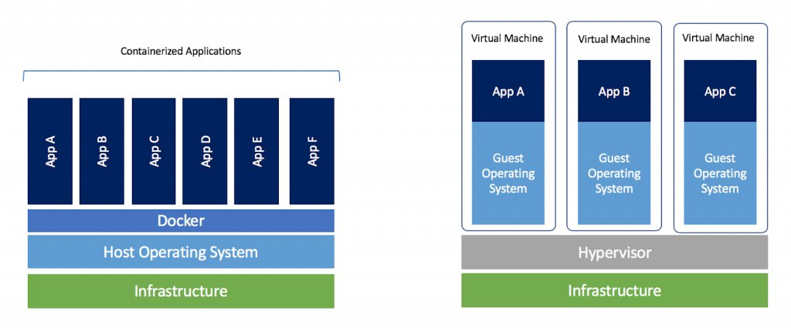

# Learning Docker

## Introduction

Containers are a convenient way of packaging all the applications that you need and deploy it anywhere you want, and Docker is a software that allows you to do this. To put it simply, Docker solves the problem of "It works on my computer, why doesn't it work on yours?". 

To understand what containers are, one must first understand what virtual machines are. The way I understand virtual machines is the following. Imagine your laptop, where you are typing away and interacting with what's shown on the screen. Now imagine it, except without the keyboard, glass screen, plastic covering, battery, motherboard, CPUs and all the internal hardware inside it. All of the hardware has been abstracted away, with only the operating system and running applications remaining, which makes your laptop a virtual machine. In this way virtual machines "virtualize" the underlying hardware.

Containers take it one step further. They virtualize the underlying operating system as well, leaving only the applications on top. This makes them very lightweight compared to virtual machines, where an entire operating system (such as Windows or macOS) has to be installed in order for us to use them. Docker uses Linux as its operating system kernel (a kernel is the operating system's core, which directly interacts with and runs on top of the hardware), and most containers use the lightweight Alpine flavour of Linux because of its size. Compared to virtual machines, which has sizes on the order of several gigabytes, container sizes are only on the order of megabytes.

## 